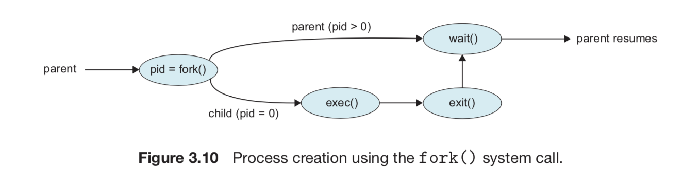

## Process
- A program during execution
- A program is loaded into memory. And CPU read instruction to execute it...

## I/O
- I/O need to use the CPU
- https://stackoverflow.com/questions/13596997/why-is-the-cpu-not-needed-to-service-i-o-requests
- Multi thread is good if program have many I/O

## Fork() and Wait()
- https://stackoverflow.com/questions/15102328/how-does-fork-work

## Heap vs Stack:
### Heap
- 1 heap for 1 process. 
- Object saved in heap 
    
### Stack:
- 1 stack for 1 thread
- LIFO order. Whenever a method is invoked, 
a new block is created in the stack memory 
for the method to hold local primitive values and reference to other objects in the method
- the most recently reserved block is always the next block to be freed

## Socket
- Can be On top of TCPSocket or UDPSocket
- the way two process can talk together
- each socket will have an identifier is ip and port
- can use to write our all http request, response
- HTTP is an application protocol, Socket is an operating system API. 
- This means HTTP can not be based on sockets the same as cars are not based on gasoline.
But sockets can be used to implement a HTTP server/client since sockets can be 
used to implement any kind of TCP server/client and HTTP is an application layer protocol 
on top of TCP. But note that sockets are not essential to implement HTTP, 
i.e. you could use any other kind of API which manages to send network packets to implement it.

## User Space vs Kernel Space
Memory is divided into 2 parts
- The user space, which is a set of locations where normal user processes run 
(i.e everything other than the kernel). The role of the kernel is to manage applications 
running in this space from messing with each other, and the machine.
- The kernel space, which is the location where the code of the kernel is stored, 
and executes under.

## IPC
- Inter process communication (IPC) is a mechanism 
which allows processes to communicate each other and synchronize their actions
- Can use share memory or message passing

## Semaphore vs mutex vs spinlock
- **Mutex** is a locking mechanism and alow multiple thread of multiple process to access 
sharing resource. But just one at a time. When thread need resource, it will aquire 
the lock on that resource and release the lock after used
- **Semaphore** is multiple thread to access same resource at a time.
When thread access, it will call wait() and decrease the value 1
When done using, it will call signal() and increament the value 1
- **Spinlock** is a lock that use busy waiting. It means the thread will keep asking
for the lock is released ? instead of go to sleep and wake up in mutex

## File descriptor
- You will have file descriptor for each process. That's pointers to the files you open in the process
- That is actually a list integer that is entry for the 0: stdin, 1: stoud, 2: stderr, 3: when you open a file
